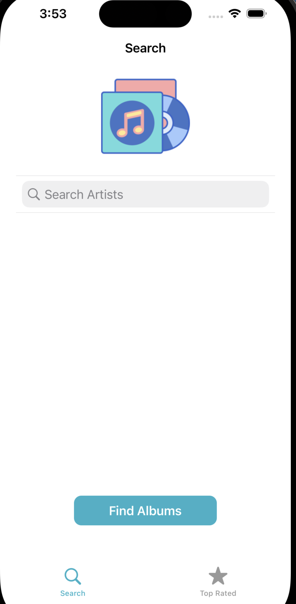

## Album Finder
This is an iOS application that allows users to search for albums by a specific user and save their favorite albums.

### Features
* Search for albums by user ID
* View album details
* Save favorite albums
* View a list of saved favorite albums


### Requirements
* Xcode 12 or later
* iOS 14 or later
* Swift 5 or later

### Getting Started
1. Clone the repository
```
git clone https://github.com/wliang002/Album-Finder.git
```

2. Open the project in Xcode
3. Build and run the project on a simulator or device


### Usage
* On the home screen, enter a username tap "Search"
* A list of albums associated with that user ID will be displayed
* Tap on an album to view more details
* Tap the "Favorite" button to save the album to your favorites list
* To view your saved favorite albums, tap the "Favorites" tab

### Screens
<p align="center">
 <br/><br />
 <br /><br />
 <br /> <br />
